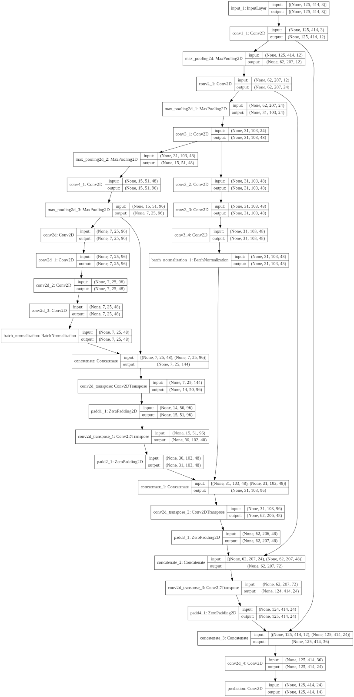
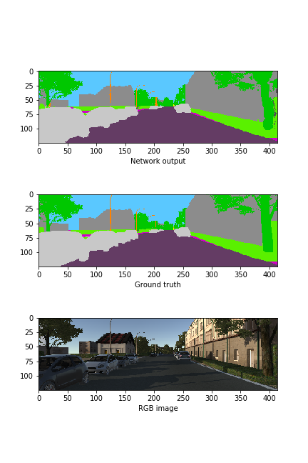
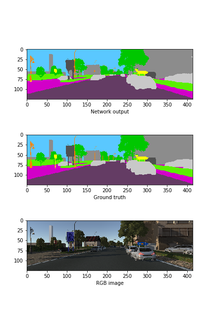
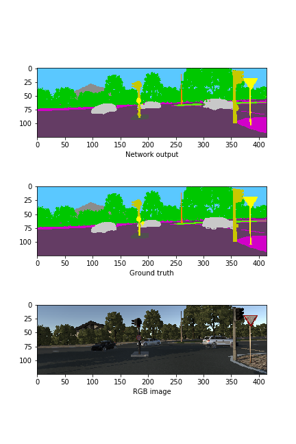
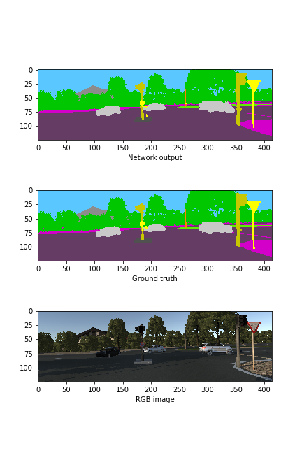

# Deep neural networks for semantic segmentation

We train deep neural networks for semantic segmentation of urban road scenes using Keras. As training data, we use RGB images from the virtual KITTI dataset, which can be downloaded [here](https://europe.naverlabs.com/Research/Computer-Vision/Proxy-Virtual-Worlds/). Two networks are trained: a simpler network with a multi-branch structure that is partially inspired by U-net and Fast-SCNN (1902.04502) and has very few trainable parameters, and a more advanced architecture that is partially inspired by EdgeSegNet (1905.04222).

Due to hardware limitations, we rescale the images from the KITTI dataset to 1/3 of their original size and train the network with up to 447 images only (for example from folder `0001/sunset`). As we are interested in semantic segmentation and not instance segmentation, we preprocess the ground truth images such that instance ids are mapped to object class ids. The simpler network achieves a validation accuracy of 0.976 and a validation mean IoU of around 0.67. Having in mind the small number of training images and trainable parameters, this seems to be a fair result. The more advanced model did not train well, so we do not include results for now (The mentioned paper does not give all the results of the model, which makes it a bit hard to reproduce the results...). We discuss the results in a bit more detail below.

## Setting up the environment
 1. Check out this repository
 2. Download the images with RGB and semantic information from above link and store them in folder `Code` and extract them to folder `Code/Data` (or use the corresponding commands in the jupyter notebook).
 3. Set up the `anaconda` environment by running `conda env create -f environment.yml`.
 4. Run `jupyter notebook train_network.ipynb` in `Code` folder and execute all steps for retraining the networks. This creates a folder `Code/Data_compressed', containing as preprocessed data an `hdf5` file with compressed images and a binary file with pickled dictionaries for mapping object class ids to colour values and vice versa. Subsequently, using the notebook the networks can be defined and trained using Keras.

## Network architecture of simple model
As mentioned above, the simple multi-branch model is inspired by U-net and Fast-SCNN (1902.04502). Here is an overview of the network architecture, as generated from `keras`:

It would certainly be possible to improve this network. A few obvious ideas are

  * Introduce `DepthwiseConv2d` instead of `Conv2d` on encoder path for reducing the number of weights
  * Use `UpSampling2D` for replacing the very heavy `Conv2DTranspose` layers right after bottle neck
  * Conveniently cut images so that zero padding is unnecessary
  * Improve the loss function so that rare object classes (in terms of occurency as pixels) are weighted stronger (this should increase the mIoU)
  * Use more images during training!
  * Add additional layers as this model has only 470k trainable parameters!

## Results for simple model
Here are some examples of semantically segmented images for input from the validation dataset (from top to bottom: generated image, ground truth, colour image):

 
 

It seems that the network works quite well for object classes that occur often on the pixel level (for example street, building, vegetation, cars), but has problems in detecting object classes that are rare on the pixel levels (for example street signs). This might be a consequence of the small number of training images, and might either be improved by increasing the number of training images or by reweighting the object classes in the loss function. This interpretation of the results is supported by the validation accuracy and mean IoU, which are 0.976 and 0.67 for the employed categorical cross-entropy loss. 