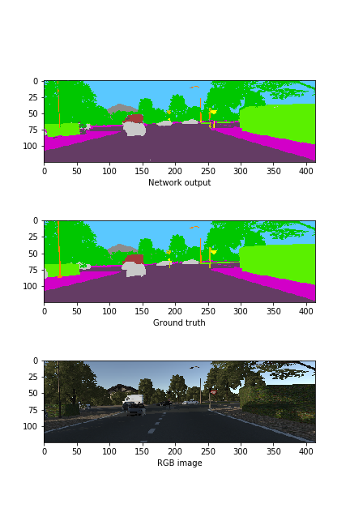
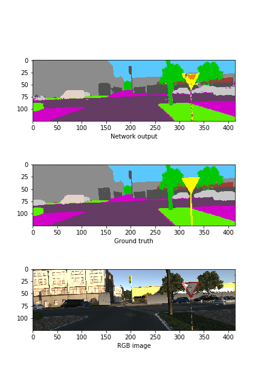
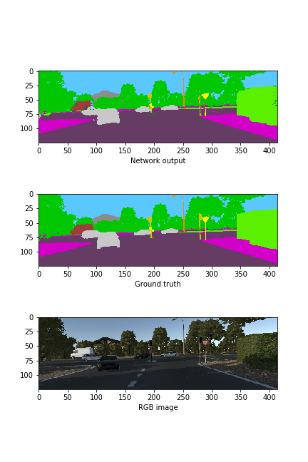
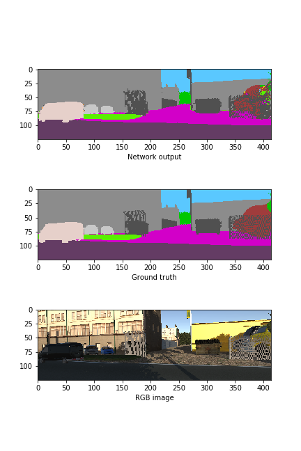

# Deep neural network for semantic segmentation

We train a deep neural network for semantic segmentation of urban road scenes using Keras. As training data, we use RGB images from the virtual KITTI dataset, which can be downloaded [here](https://europe.naverlabs.com/Research/Computer-Vision/Proxy-Virtual-Worlds/). The network has a multi-branch structure that is partially inspired by U-net and Fast-SCNN (1902.04502).

Due to hardware limitations, we rescale the images from the KITTI dataset to 1/3 of their original size and train the network with up to 447 images only (for example from folder `0001/sunset`). As we are interested in semantic segmentation and not instance segmentation, we preprocess the ground truth images such that instance ids are mapped to object class ids. The network achieves a validation accuracy of 0.967 and a validation mean IoU of around 0.5. Having in mind the small number of training images, this seems to be a fair result. We discuss the results in a bit more detail below.

## Setting up the environment
 1. Check out this repository
 2. Download the images with RGB and semantic information from above link and store them in folder `Data`.
 3. Set up the `anaconda` environment by running `conda env create -f environment.yml`.
 4. Run `jupyter notebook prepare_data.ipynb` in the `Code` folder and execute all steps. This creates a folder `Data_compressed' in the project folder, containing a `hdf5` file with compressed images and a binary file with pickled dictionaries for mapping object class ids to colour values and vice versa.
 5. Run `jupyter notebook train_network.ipynb` in `Code` folder and execute all steps for retraining the network.

## Network architecture
As mentioned above, we implemented a multi-branch model that is inspired by U-net and Fast-SCNN (1902.04502). Here is an overview of the network architecture, as generated from `keras`:

It would certainly be possible to improve this network. A few obvious ideas are

  * Introduce `DepthwiseConv2d` instead of `Conv2d` on encoder path for reducing the number of weights
  * Use upsampling for very heavy `Conv2DTranspose` layers right after bottle neck
  * Conveniently cut images so that zero padding is unnecessary
  * Introduce batch normalization on every branch before merging with `concatenate`
  * Improve the loss function so that rare object classes (in terms of occurency as pixels) are weighted stronger (this should increase the mIoU)
  * Use more images during training!

## Results
Here are some samples for images generated by the network (from top to bottom: generated image, ground truth, colour image):

 
 

It seems that the network works quite well for object classes that occur often on the pixel level (for example street, building, vegetation, cars), but has problems in detecting object classes that are rare on the pixel levels (for example street signs). This might be a consequence of the small number of training images, and might either be improved by increasing the number of training images or by reweighting the object classes in the loss function. This interpretation of the results is supported by the validation accuracy and mean IoU, which are 0.967 and 0.5 for the employed categorical cross-entropy loss. 

Using mean absolute error as the loss function instead, we obtained a validation mean IoU of 0.7 and a validation accuracy of 0.65. The generated images from the resulting network looked far worse than those shown above.